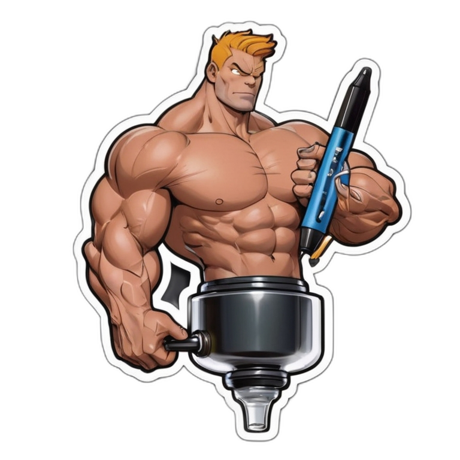

# Auto-Gains: Autonomous Blog Content Generation



Auto-Gains is your go-to solution for effortless blog creation, blending autonomy and muscle gains. Harnessing the power of Python, Streamlit, Open API, LangChain, and Tiktoken, this app enables users to generate captivating blog content seamlessly.

## Features

- **Autonomous Creativity:** Input your blog topic, category, word count, and an optional YouTube video URL. Auto-Gains autonomously transcribes, summarizes, and integrates valuable insights from the video into your blog content.
- **Catchy Title Generation:** Our AI-powered system crafts engaging titles for your blogs, ensuring they stand out in the digital landscape.
- **Flexibility and Convenience:** Whether you're a content creator or just starting, Auto-Gains adapts to your needs, providing a hassle-free experience.

## Getting Started

### Prerequisites

Make sure you have Python installed on your system.

### Installation

1. Clone the repository:

```sh
git clone https://github.com/lasnab/auto-gains.git
cd auto-gains
```

2. Create a virtual environment:

```sh
python -m venv .venv
```

3. Activate the virtual environment:

```sh
source .venv/bin/activate
```

4. Install dependencies:

```sh
pip install -r requirements.txt
```

### Usage

Run the Streamlit app:

```sh
streamlit run app.py
```

If the above command doesn't work, use the long-form command:

```sh
python -m streamlit run app.py
```

When you're finished, deactivate the virtual environment:

```sh
deactivate
```

Unleash your creativity, boost your blog game, and experience the gains with Auto-Gains!

## Contributing

Contributions are welcome! Feel free to open issues or submit pull requests.

## License

This project is licensed under the [MIT License](LICENSE).

## Credits

- https://github.com/patrickloeber/python-github-action-template
